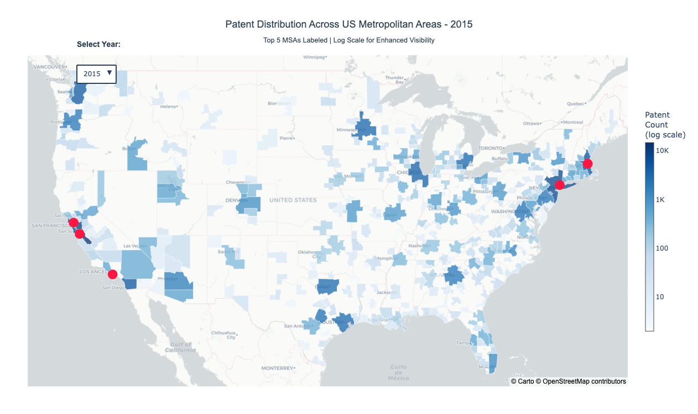

Patent Activity Analysis Across US Metropolitan Areas

This project analyzes how patent activity is distributed across U.S. metropolitan statistical areas (MSAs) and how that activity changed between 2000 and 2015. The goal is to understand where innovation is concentrated, which regions are growing, and which ones are slowing down.

The analysis is fully reproducible in Python and focuses on clear, map-based storytelling rather than complex modeling.

⸻

What This Project Covers
	•	Geographic distribution of patent counts across U.S. MSAs
	•	Percentage change in patent activity from 2000 to 2015
	•	Identification of high-growth and declining innovation regions
	•	Comparison between absolute patent volume and growth trends

⸻

Data Overview
	•	Unit of analysis: U.S. Metropolitan Statistical Areas (MSAs)
	•	Time period: 2000–2015
	•	Key metrics:
	•	Total patent counts by MSA and year
	•	Percentage change in patent activity over time

The data was cleaned and aggregated to ensure consistent MSA boundaries across years.

⸻

Visualizations

1. Change in Patent Activity (2000–2015)

This choropleth map shows how patent activity changed over time.
	•	Green areas indicate growth in patent filings
	•	Red areas indicate decline
	•	Darker shades represent larger magnitude of change

Key takeaway:
Patent growth is uneven across the U.S. While several coastal and tech-driven regions show strong growth, many interior and smaller MSAs experienced stagnation or decline.

⸻

2. Patent Distribution Across MSAs (2015)

This map shows the geographic concentration of patent activity in 2015.
	•	Color intensity reflects total patent count
	•	Log scale is used to handle large differences between MSAs
	•	Top MSAs are highlighted to show dominant innovation hubs

Key takeaway:
Patent activity is highly concentrated. A small number of metropolitan areas account for a disproportionate share of total patents, highlighting strong regional clustering of innovation.

⸻

Tools and Technologies
	•	Python
	•	Pandas and NumPy for data manipulation
	•	GeoPandas for spatial analysis
	•	Plotly for interactive maps
	•	Jupyter Notebook for analysis and visualization

⸻

How to Run the Project
	1.	Clone the repository
	2.	Install required Python libraries
	3.	Open the Jupyter notebook:

Choropleth_Maps.ipynb

	4.	Run all cells to reproduce the analysis and maps

⸻

Why This Project Matters

This project demonstrates:
	•	Practical geospatial analysis in Python
	•	How to communicate regional trends through maps
	•	The difference between growth rates and absolute scale
	•	Strong data storytelling using real-world innovation data

It is especially relevant for roles involving data analysis, economic analysis, urban studies, or innovation policy.

⸻

Future Improvements
	•	Add industry-level patent breakdowns
	•	Extend analysis beyond 2015
	•	Compare patent growth with population or GDP growth
	•	Deploy interactive maps as a web dashboard

⸻

Author

Mihir Parab
