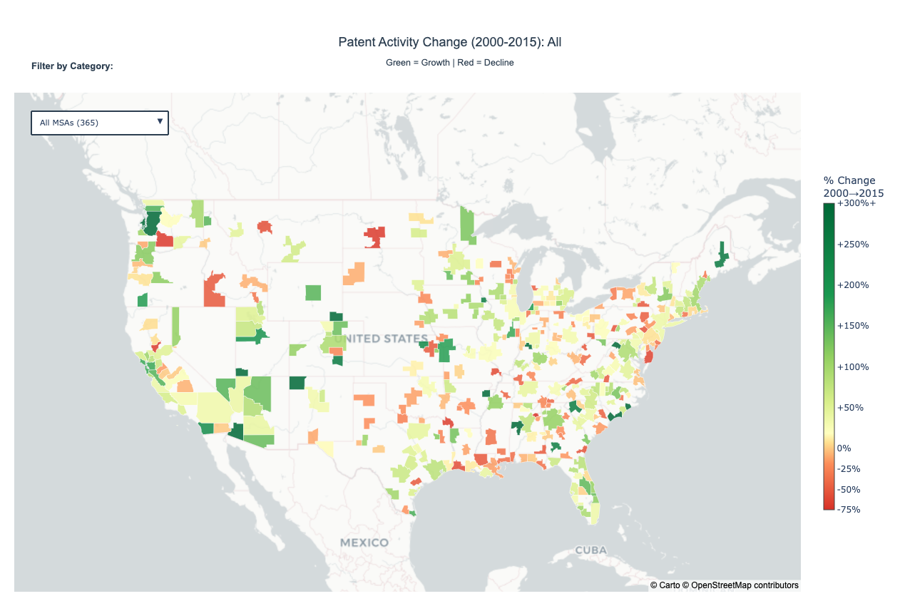

# Patent Activity Analysis Across US Metropolitan Areas (2000–2015)

**Tags:** #Python #DataVisualization #Plotly #GeoPandas #Choropleth #Innovation #Patents #MSA #Geospatial #Jupyter

This project analyzes how patent activity is distributed across U.S. metropolitan statistical areas (MSAs) and how it changed between **2000 and 2015**.  
It highlights where innovation is concentrated, which regions grew, and which ones declined using map-based visualizations.

---

## Quick Links
- 📒 Notebook: `Choropleth_Maps.ipynb`
- 🗺️ Interactive maps (HTML):
  - `patent_choropleth_interactive.html`
  - `patent_delta_filtered.html`

---

## What I Built
- ✅ Cleaned and prepared MSA-level patent data (2000–2015)
- ✅ Built **choropleth maps** for:
  - Patent **distribution** (2015)
  - Patent activity **% change** (2000 → 2015)
- ✅ Used a **log scale** to make high vs low patent regions readable
- ✅ Highlighted top MSAs to show dominant innovation hubs

---

## Data Overview
- **Unit:** U.S. MSAs (Metropolitan Statistical Areas)
- **Time Range:** 2000–2015
- **Metrics:**
  - Patent count by MSA and year
  - % change in patent activity (2000 to 2015)

---

## Visualizations

### 1) Patent Activity Change (2000–2015)
Green = growth, Red = decline. Darker colors mean larger change.



**Insight:** Growth is uneven. Some MSAs show strong increases, while many others are flat or declining.

---

### 2) Patent Distribution Across MSAs (2015)
Color intensity shows patent volume (log scale for readability). Top MSAs are labeled.


**Insight:** Patent activity is highly concentrated in a small number of metros.

---

## Tech Stack
- Python
- Pandas, NumPy
- GeoPandas
- Plotly
- Jupyter Notebook

---

## How to Run
1. Clone the repo
2. Install dependencies
   ```bash
   pip install pandas numpy geopandas plotly
